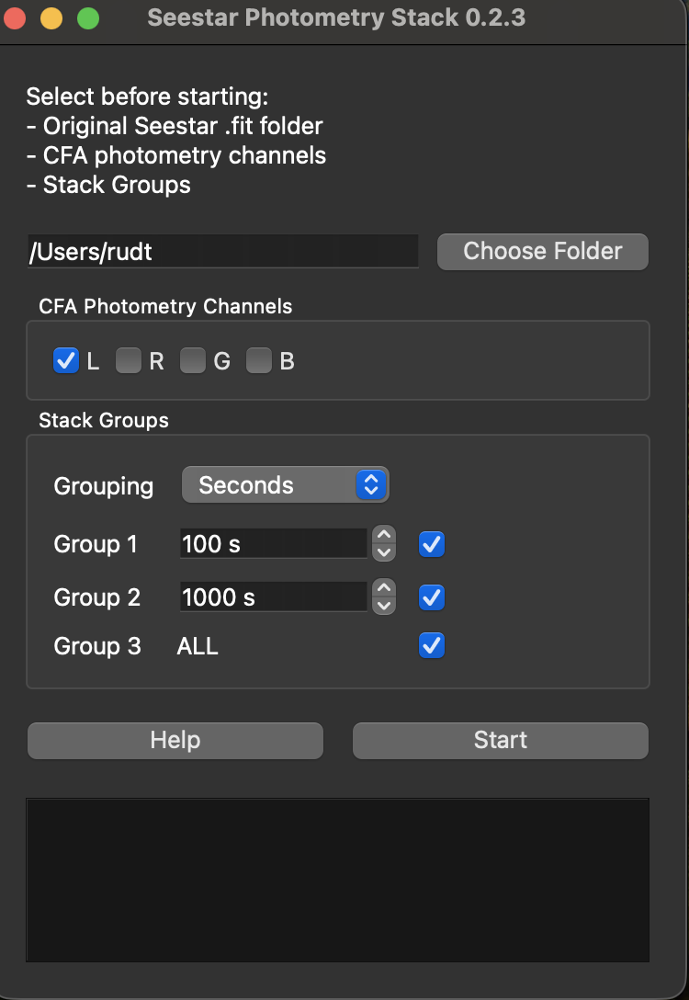

# Seestar Photometry Stack

Siril Python preprocessing script for original Seestar `.fit` frames. The script prepares CFA/Bayer data for downstream photometry workflows by creating photometry-oriented L/R/G/B products and registered stack groups.

## Screenshot



## Features

- Uses original Seestar `.fit` frames directly from one selected source folder.
- Extracts CFA photometry channels `L`, `R`, `G`, and `B` without debayer interpolation.
- Keeps channel products at the original Seestar image size for downstream compatibility.
- Registers frames before stacking.
- Creates stack groups by duration, by frame count, or `ALL`.
- Writes photometry-oriented FITS timing metadata.
- Records output provenance and preserves unambiguous channel metadata.
- Accepts source folders selected through the dialog or pasted as local/file URLs.
- Cleans up stale Siril display state before processing and continues after individual stack-block failures.
- Provides a dark standalone interface with single-instance protection.
- Confirms before clearing existing result folders.

## Limitations

This script does not perform complete photometric measurement.

A separate companion tool for full differential variable-star photometry is already under development and is expected to be released in September 2026. It will be maintained in its own repository.

## Requirements

- Siril 1.3.0 or newer with Python scripting support.
- `sirilpy` 1.0.13 or newer.
- Python packages: `PyQt6`, `astropy`, and `numpy`.

The script is intended to run inside Siril's Python environment, not as a standalone system-Python program. Missing Python packages are checked and installed through Siril when possible.

## Usage

1. Copy `SeePhot_CFA.py` into a Siril Python script directory.
2. Start Siril and run the script from the Scripts menu.
3. Select the folder containing the original Seestar `.fit` frames.
4. Select CFA photometry channels as needed: `L`, `R`, `G`, `B`.
5. Select stack groups: seconds, frame count, or `ALL`.
6. Click `Start`.

## Result Folders

Results are written next to the selected source folder. Original input frames are not modified.

Example source folder:

```text
Light_001
```

Possible result folders:

```text
Light_001_l
Light_001_r
Light_001_g
Light_001_b
Light_001_l-stack100sec
Light_001_l-stack1000sec
Light_001_l-stackall
```

For non-CFA input, stack folders use no channel suffix, for example:

```text
Light_001-stack100sec
```

Temporary folders use `<source>-tmp...` names and are removed when the run ends.

## FITS Timing

Seestar `DATE-OBS` is treated as the exposure end time of an individual original frame.

Generated stack products use:

- `DATE-OBS`: UTC exposure start
- `DATE-END`: UTC exposure end
- `DATE-AVG`: exposure-weighted midpoint
- `MJD-AVG`: exposure-weighted midpoint as MJD
- `EXPTIME`: summed exposure time of the used frames, excluding gaps
- `NCOMBINE`: number of frames included in the stack

## CFA Channels

For CFA/Bayer input, Siril is used to split measured CFA samples. The script does not create debayer-interpolated RGB images for photometry.

- `L`: mean of one Bayer cell, `(R + G1 + G2 + B) / 4`
- `G`: mean of the two green samples, `(G1 + G2) / 2`
- `R`: measured red CFA sample
- `B`: measured blue CFA sample

`FILTER` and `CHANMODE` are written into the FITS header to document the derived channel.

## Support

Bug reports and support requests:

https://github.com/Aquarius58/siril-seestar-stack/issues

## License

GPL-3.0-or-later. See `LICENSE` and `SeePhot_CFA.py` for details.
